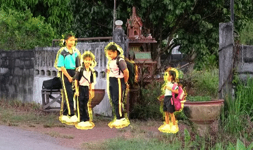
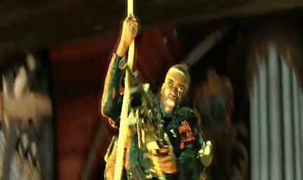
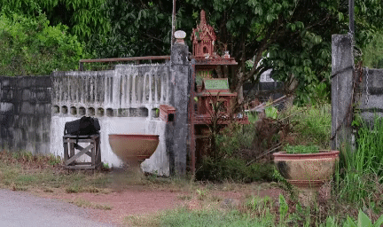
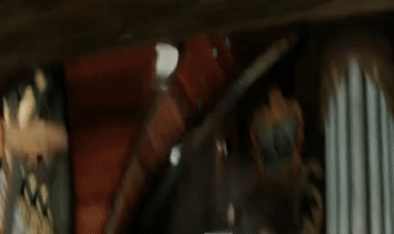

# [ECCV 2022] Flow-Guided Transformer for Video Inpainting
[](https://www.murphysec.com/dr/Mv2KZkf8cimnLKgoC4)
[](https://github.com/hitachinsk/FGT/blob/main/LICENSE)

### [[Paper](https://arxiv.org/abs/2208.06768)] / [[Demo](https://youtu.be/BC32n-NncPs)] / [[Project page](https://hitachinsk.github.io/publication/2022-10-01-Flow-Guided-Transformer-for-Video-Inpainting)]

This repository contains the implementation of the following paper:
> **Flow-Guided Transformer for Video Inpainting**<br>
> [Kaidong Zhang](https://hitachinsk.github.io/), [Jingjing Fu](https://www.microsoft.com/en-us/research/people/jifu/) and [Dong Liu](https://faculty.ustc.edu.cn/dongeliu/)<br>
> European Conference on Computer Vision (**ECCV**), 2022<br>

        

        

 It is too tedious to run the codes on the local server? Feel free to play with our provided online demos!
 - Colab demo: [](https://colab.research.google.com/drive/19KOSVsfVs2Yy38r-6ptZae_8frJShLOS?usp=sharing)


## Overview
 

We propose a flow-guided transformer, which innovatively leverage the motion discrepancy exposed by optical flows to instruct the attention retrieval in transformer for high fidelity video inpainting. More specially, we design a novel flow completion network to complete the corrupted flows by exploiting the relevant flow features in a local temporal window. With the completed flows, we propagate the content across video frames, and adopt the flow-guided transformer to synthesize the rest corrupted regions. We decouple transformers along temporal and spatial dimension, so that we can easily integrate the locally relevant completed flows to instruct spatial attention only. Furthermore, we design a flow-reweight module to precisely control the impact of completed flows on each spatial transformer. For the sake of efficiency, we introduce window partition strategy to both spatial and temporal transformers. Especially in spatial transformer, we design a dual perspective spatial MHSA, which integrates the global tokens to the window-based attention. Extensive experiments demonstrate the effectiveness of the proposed method qualitatively and quantitatively.

## Todo list
- [ ] Test the video frame extrapolation results.
- [ ] Update the real-world results.
- [ ] Add Huggingface demo

## Prerequisites

- Linux (We tested our codes on Ubuntu20.04)
- Anaconda
- Python 3.6.8
- Pytorch 1.10.1

To get started, first please clone the repo
```
git clone https://github.com/hitachinsk/FGT.git
```
Then, please run the following commands:
```
conda create -n FGT python=3.6.8
conda activate FGT
pip install -r requirements.txt
pip install imageio-ffmpeg
```

## Quick start
You can try our online demos: [](https://colab.research.google.com/drive/19KOSVsfVs2Yy38r-6ptZae_8frJShLOS?usp=sharing)

If you need to run the codes on the local servers, here are the instructions.
1. Download the [[pre-trained models](https://drive.google.com/file/d/1CLfeZjBWDHcbcr0J2EHBr6Qbc03cKcJg/view?usp=sharing)], and the [[data](https://drive.google.com/file/d/1aDhC78P0bD9GrKl9mjikyRnRomjeS22h/view?usp=sharing)]. 
    - You can also get access to our models at [](https://huggingface.co/hitachinsk/FGT)
3. Put the downloaded zip files to the root directory of this project
4. Run `bash prepare_data.sh` to unzip the files
5. Run the object removal demo
```bash
cd tool
python video_inpainting.py --path ../data/frames/schoolgirls \
--path_mask ../data/masks/schoolgirls \
--outroot ../data/results/schoolgirls
```
If everythings works, you will find a `result.mp4` file in `data/results/schoolgirls`. And the video should be like:


We also prepare other video sequences for you to test. All you need to do is to change the input and output paths, have fun!

### Watermark removal
<details>
<summary>Click to open</summary>
 <pre><code>
cd tool
python video_inpainting.py --opt configs/watermark_removal.yaml \
--mode watermark_removal \
 --path "Path to the video frames" \
--path_mask "Path to the video masks" \
--outroot "Path to save the results"
</code></pre>
</details>

### Video extrapolation (outpainting)
<details>
<summary>Click to open</summary>
 <b>Warning</b>: This function has not been uploaded yet.
 <pre><code>
cd tool
python video_inpainting.py --opt configs/video_extrapolation.yaml \
--mode video_extrapolation \
 --path "Path to the video frames" \
--path_mask "Path to the video masks" \
--outroot "Path to save the results"
</code></pre>
</details>

## Training
Our codes follows a two-stage training process. In the first stage, we train the flow completion network (LAFC), and then we train the flow-guided transformer model (FGT).
We assume you are at the root directory of this repo.

First, please prepare the dataset for training.
1. Please download Youtube-VOS **2018** in the official link.
2. Unzip the Youtube-VOS files to `/myData/youtubevos_frames`
3. Extract the flows from Youtube-VOS with RAFT (or other flow extraction methods) and put the extracted files to `/myData/youtubevos_flows`

Second, train the LAFC model
```bash
cd LAFC
python train.py
```

Third, train the FGT model. Since LAFC takes multiple flows as input, the IO cost is huge for the training of FGT model. Therefore, we adopt the 2D version of LAFC (replace all the P3D convolutions to 2D convolutions) to guide the training of FGT. We provide a pretrained model in `LAFC/flowCheckpoint`, if you want to train this model by yourself, follow the command below.
```bash
python train.py --opt train_single.yaml
```
As for the training of FGT model, run the command below.
```bash
cd ../FGT
python train.py
```

## License
This work is licensed under MIT license. See the [LICENSE](LICENSE) for details.

## Citation
If our work inspires your research or some part of the codes are useful for your work, please cite our paper:
```bibtex
@misc{zhang2022flowguided,
      title={Flow-Guided Transformer for Video Inpainting}, 
      author={Kaidong Zhang and Jingjing Fu and Dong Liu},
      year={2022},
      eprint={2208.06768},
      archivePrefix={arXiv},
      primaryClass={cs.CV}
}
```

Our other video inpainting paper:
```bibtex
@InProceedings{Zhang_2022_CVPR,
    author    = {Zhang, Kaidong and Fu, Jingjing and Liu, Dong},
    title     = {Inertia-Guided Flow Completion and Style Fusion for Video Inpainting},
    booktitle = {Proceedings of the IEEE/CVF Conference on Computer Vision and Pattern Recognition (CVPR)},
    month     = {June},
    year      = {2022},
    pages     = {5982-5991}
}
```

## Contact
If you have any questions, please contact us via 
- richu@mail.ustc.edu.cn

## Acknowledgement
Some parts of this repo are based on [FGVC](https://github.com/vt-vl-lab/FGVC) and [Fuseformer](https://github.com/ruiliu-ai/FuseFormer).  And we adopt [RAFT](https://github.com/princeton-vl/RAFT) for flow estimation. 


